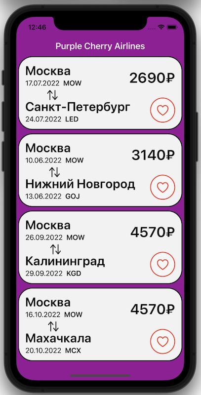

# Тестовое задание для IOS-разработчика от компании Wildberries

## Задача

Нужно создать мобильное приложение *“Пора в путешествие”* с двумя экранами.

## Первый экран
Первый экран представляет из себя список актуальных дешевых авиаперелетов.

Каждая ячейка списка должна содержать:

- Город отправления.
- Город прибытия.
- Дата отправления.
- Дата возвращения.
- Цена в рублях.
- Иконка “Лайк” (имеет два состояния и означает лайкнул ли пользователь данный авиаперелет).

## Второй экран
Второй экран - это детализация перелета с кнопкой *“Лайк”*.
Второй экран открывается при выборе одной из ячеек первого экрана. Должна быть возможность вернуться к первому экрану назад.

Второй экран содержит данные по выбранному перелету (город отправления, город прибытия, дата отправления, дата возвращения, цена в рублях) и кнопку *“Лайк”*.

Кнопка лайк имеет два состояния:

- Перелет нравится.
- Перелет не нравится.

## Примечания

- Дизайн произвольный, на усмотрение разработчика.
- Список авиаперелетов запрашивается один раз при старте приложения.
- Пока происходит загрузка списка должен быть отображен индикатор загрузки.
- Если пользователь лайкнул перелет и вернулся в список перелетов, то в списке у “лайкнутого” перелета должна “гореть” иконка *“Лайк”*.
- Если пользователь “лайкнул” перелет, вышел на первый экран и еще раз зашел на второй экран, то кнопка *“Лайк”* должна быть в состоянии “Перелет нравится” и наоборот.
- Апи для списка авиаперелетов: https://travel.wildberries.ru/statistics/v1/cheap.

# Результат

## Первый экран

На этом экране содержится таблица с полётами. В каждой ячейке есть:
* Город отправления.
* Дата отправления.
* Код города отправления.
* Город прибытия.
* Дата возвращения.
* Код города прибытия.
* Цена в рублях.
* Иконка “Лайк” (имеет два состояния и означает лайкнул ли пользователь данный авиаперелет). Данная иконка является активной: её можно нажать.

## Второй экран

На втором экране содержится вся информация, что и на первом экране, но с добавлением нескольких изображений.

## Процесс выполнения
* В процессе выполнения были созданы и использованы кастомные цвета (*WBPurplish*, *WBRed*, *WBGrey1* и *WBGrey0*).
* Список полётов запрашивается один раз и далее хранится в **NetworkService** и его данные используются при помощи **FlightsDataPublisher**.
* Для отображения анимации загрузки была использована сторонняя библиотека **GIFImageView** .
* *“Лайк”* на перелёт можно ставить как с экрана этого полёта, так и с экрана со списком полётов.
